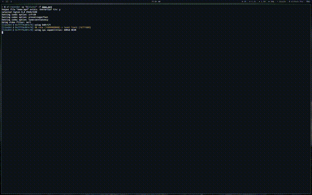

# gentoo.c

A spinning 3D Gentoo logo in your terminal, written in C. Inspired by the
classic donut.c.



It takes the ASCII Gentoo logo (the one fastfetch shows), turns each filled
character into a point in 3D space, gives it a bit of thickness, and rotates
the whole thing on two axes with depth shading and a z-buffer.

## Build

```
cc gentoo.c -o gentoo -lm
```

## Run

```
./gentoo
```

It clears the screen and animates in place. Ctrl-C to stop.

## How it works

- The logo is embedded as an array of strings
- Each ASCII character's visual density (M=heaviest, dots/dashes=lightest)
  maps to a height value, creating a 3D relief from the logo itself
- Surface normals are derived from the height field gradient, giving natural
  shading that follows the curves of the swirl
- Blinn-Phong shading with diffuse + specular highlights
- Every frame: rotate every point around X and Y, project with perspective,
  z-buffer, and shade by surface normal

~300 lines, no dependencies beyond libm.
